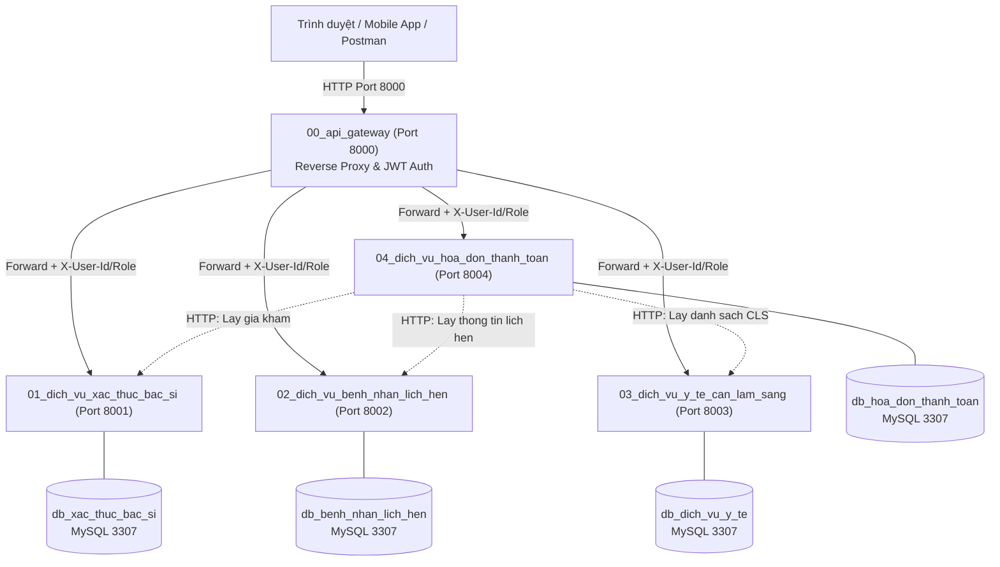

# BẢN VẼ THIẾT KẾ KIẾN TRÚC MICROSERVICES (ARCHITECTURE BLUEPRINT)
## HỆ THỐNG QUẢN LÝ PHÒNG KHÁM ĐA KHOA

Hệ thống được thiết kế theo mô hình **Microservices** chuẩn hóa trên nền tảng **Laravel 12** và **Máy chủ Laragon (PHP 8.2, MySQL Port 3307)**.

---

## 1. Sơ Đồ Tổng Quan Hệ Thống



---

## 2. Nguyên Tắc Thiết Kế Cốt Lõi

1. **Database-per-Service:** Mỗi microservice sở hữu cơ sở dữ liệu riêng biệt. Tuyệt đối không query cross-database hoặc dùng Foreign Key vật lý giữa các database khác nhau.
2. **Naming Convention:** 100% Tiếng Việt KHÔNG DẤU (`TaiKhoan`, `BacSi`, `LichHen`, `DichVu`, `HoaDon`,...).
3. **API Gateway As Single Entry Point:**
   - Client chỉ giao tiếp duy nhất qua cổng **8000**.
   - Gateway xác thực Token JWT tập trung.
   - Khi hợp lệ, Gateway tự động giải mã thông tin và đính kèm các Header sau tới các service con:
     + `X-User-Id`: ID tài khoản người dùng
     + `X-User-Role`: Vai trò (`ADMIN`, `BAC_SI`, `BENH_NHAN`)
     + `X-User-Email`: Email người dùng
     + `X-User-Name`: Họ tên người dùng
4. **Inter-Service Communication (Giao tiếp liên dịch vụ):**
   - Service 04 (Hóa đơn) giao tiếp qua HTTP Client (`Http::timeout(3)->get(...)`) để tự động tổng hợp chi phí từ Service 01, Service 02 và Service 03.
   - Có cơ chế Fallback an toàn nếu một dịch vụ phản hồi chậm hoặc tạm gián đoạn.

---

## 3. Phân Chia Trách Nhiệm Nghiệp Vụ & Thành Viên

### 👤 Người 1: Microservice 01 (`01_dich_vu_xac_thuc_bac_si` - Port: 8001)
- **Cơ sở dữ liệu:** `db_xac_thuc_bac_si`
- **Thực thể (Models):**
  - `VaiTro` (`id`, `ma_vai_tro`, `ten_vai_tro`, `mo_ta`)
  - `TaiKhoan` (`id`, `vai_tro_id`, `ho_ten`, `email`, `so_dien_thoai`, `mat_khau`, `trang_thai`)
  - `ChuyenKhoa` (`id`, `ma_chuyen_khoa`, `ten_chuyen_khoa`, `mo_ta`)
  - `BacSi` (`id`, `tai_khoan_id`, `chuyen_khoa_id`, `hoc_vi`, `so_nam_kinh_nghiem`, `gia_kham`, `trang_thai`)
- **Endpoints chính:**
  - `POST /api/xac-thuc/dang-nhap`: Xác thực & cấp phát token JWT.
  - `POST /api/xac-thuc/dang-ky`: Đăng ký tài khoản bệnh nhân / người dùng mới.
  - `GET /api/xac-thuc/thong-tin`: Lấy thông tin tài khoản hiện tại từ Gateway Header.
  - `GET /api/bac-si`: Danh sách bác sĩ (hỗ trợ lọc theo `chuyen_khoa_id`).
  - `GET /api/bac-si/{id}`: Chi tiết bác sĩ và giá khám (Service 04 dùng endpoint này).
  - `POST /api/bac-si`: Thêm bác sĩ mới (quyền ADMIN).
  - `GET /api/chuyen-khoa`: Danh sách các chuyên khoa.

---

### 👤 Người 2: Microservice 02 (`02_dich_vu_benh_nhan_lich_hen` - Port: 8002)
- **Cơ sở dữ liệu:** `db_benh_nhan_lich_hen`
- **Thực thể (Models):**
  - `BenhNhan` (`id`, `tai_khoan_id`, `ma_benh_nhan`, `ho_ten`, `ngay_sinh`, `gioi_tinh`, `so_dien_thoai`, `dia_chi`, `tien_su_benh`)
  - `LichHen` (`id`, `benh_nhan_id`, `bac_si_id`, `ngay_kham`, `gio_bat_dau`, `gio_ket_thuc`, `ly_do_kham`, `trang_thai`, `ghi_chu_bac_si`)
- **Thuật toán Chống Trùng Lịch Bác Sĩ:**
  ```sql
  WHERE bac_si_id = :bacSiId
    AND ngay_kham = :ngayKham
    AND trang_thai != 'DA_HUY'
    AND (gio_bat_dau < :gioKetThucMoi AND gio_ket_thuc > :gioBatDauMoi)
  ```
  Nếu điều kiện trên tìm thấy bản ghi, hệ thống lập tức ném mã lỗi HTTP `409 Conflict` với mã lỗi `TRUNG_LICH_KHAM`.
- **Endpoints chính:**
  - `GET /api/benh-nhan`: Tra cứu hồ sơ bệnh nhân.
  - `POST /api/benh-nhan`: Tiếp nhận tạo hồ sơ bệnh nhân mới.
  - `GET /api/lich-hen`: Danh sách lịch hẹn khám.
  - `POST /api/lich-hen/dat-lich`: Đặt lịch khám (áp dụng thuật toán chống trùng).
  - `GET /api/lich-hen/{id}`: Chi tiết lịch hẹn (Service 04 gọi endpoint này).
  - `PUT /api/lich-hen/{id}/hoan-thanh`: Bác sĩ hoàn thành ca khám.
  - `PUT /api/lich-hen/{id}/huy`: Hủy lịch hẹn.

---

### 👤 Người 3: Microservice 03 (`03_dich_vu_y_te_can_lam_sang` - Port: 8003)
- **Cơ sở dữ liệu:** `db_dich_vu_y_te`
- **Thực thể (Models):**
  - `DichVu` (`id`, `ma_dich_vu`, `ten_dich_vu`, `loai_dich_vu`, `don_gia`, `mo_ta`, `trang_thai`)
  - `SuDungDichVu` (`id`, `lich_hen_id`, `benh_nhan_id`, `bac_si_id`, `dich_vu_id`, `so_luong`, `don_gia`, `ket_qua`, `ghi_chu`, `file_ket_qua`, `trang_thai`)
- **Endpoints chính:**
  - `GET /api/dich-vu`: Danh mục dịch vụ y tế (Xét nghiệm, Siêu âm, X-Quang, Nội soi,...).
  - `POST /api/dich-vu`: Thêm dịch vụ y tế mới.
  - `POST /api/dich-vu/chi-dinh`: Bác sĩ chỉ định danh sách cận lâm sàng cho bệnh nhân.
  - `PUT /api/dich-vu/ket-qua/{id}`: Cập nhật kết quả cận lâm sàng và kết luận.
  - `GET /api/dich-vu/lich-hen/{lich_hen_id}`: Lấy danh sách dịch vụ đã dùng theo lịch hẹn (Service 04 gọi endpoint này).

---

### 👤 Người 4: Microservice 04 (`04_dich_vu_hoa_don_thanh_toan` - Port: 8004)
- **Cơ sở dữ liệu:** `db_hoa_don_thanh_toan`
- **Thực thể (Models):**
  - `HoaDon` (`id`, `ma_hoa_don`, `lich_hen_id`, `benh_nhan_id`, `tien_kham`, `tien_dich_vu`, `tong_tien`, `giam_gia`, `thuc_thu`, `phuong_thuc_thanh_toan`, `trang_thai`, `ngay_thanh_toan`, `ghi_chu`)
  - `ChiTietHoaDon` (`id`, `hoa_don_id`, `loai_khoan_thu`, `ten_khoan_thu`, `so_luong`, `don_gia`, `thanh_tien`)
- **Cơ chế Tổng Hợp Hóa Đơn Tự Động:**
  1. Lấy thông tin lịch hẹn từ Service 02: `lich_hen_id`, `benh_nhan_id`, `bac_si_id`.
  2. Lấy giá khám bác sĩ từ Service 01: `gia_kham`.
  3. Lấy danh sách dịch vụ cận lâm sàng từ Service 03: mảng `don_gia * so_luong`.
  4. Tạo Hóa đơn và Chi tiết hóa đơn với công thức: `thuc_thu = tien_kham + tien_dich_vu - giam_gia`.
- **Endpoints chính:**
  - `POST /api/hoa-don/tao-tu-dong`: Tự động tạo hóa đơn cho lịch hẹn.
  - `GET /api/hoa-don`: Danh sách hóa đơn.
  - `GET /api/hoa-don/{id}`: Chi tiết hóa đơn và từng khoản mục thu.
  - `PUT /api/hoa-don/{id}/thanh-toan`: Thực hiện thanh toán (TIEN_MAT, CHUYEN_KHOAN, VNPAY, MOMO).
  - `GET /api/hoa-don/thong-ke`: Báo cáo thống kê doanh thu và tỷ lệ thanh toán.
