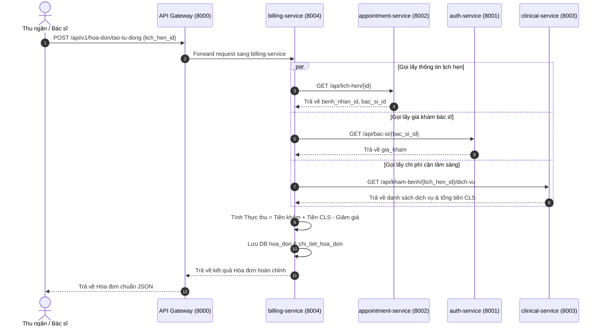

# 📋 BÁO CÁO CÔNG VIỆC PHÂN HỆ 04: HÓA ĐƠN & THANH TOÁN VIỆN PHÍ (NGƯỜI 4)
> **Dự án:** Hệ Thống Quản Lý Phòng Khám Đa Khoa (Kiến Trúc Microservices)  
> **Người thực hiện:** Người 4 (Toàn) (Phân hệ Hóa Đơn & Thanh Toán)  
> **Thư mục phụ trách:** `billing-service/` (Port `8004`)  
> **Cơ sở dữ liệu:** `db_hoa_don_thanh_toan` (MySQL Port 3306 / 3307)

---

## 📌 I. TỔNG QUAN VAI TRÒ & NHIỆM VỤ ĐÃ HOÀN THÀNH

Phân hệ 04 là **trung tâm quyết toán tài chính và viện phí**, chịu trách nhiệm tự động tổng hợp toàn bộ chi phí khám chữa bệnh từ các phân hệ khác, lập hóa đơn, xử lý thanh toán đa kênh và cung cấp báo cáo thống kê dòng tiền phòng khám.

### Các thành tựu chính:
1. **Độc lập dịch vụ:** Microservice 04 hoạt động hoàn toàn độc lập trên Port 8004, sở hữu database riêng `db_hoa_don_thanh_toan`.
2. **Cơ chế Tổng hợp Viện phí Tự động Liên dịch vụ (Core Feature):**
   - Gọi đồng thời 3 microservices để tổng hợp chi phí:
     - Gọi `appointment-service:8002`: Lấy `lich_hen_id`, `benh_nhan_id`, `bac_si_id`.
     - Gọi `auth-service:8001`: Lấy giá khám gốc (`gia_kham`) của bác sĩ.
     - Gọi `clinical-service:8003`: Lấy danh sách các dịch vụ cận lâm sàng đã chỉ định và đơn giá từng loại.
   - Tự động tính toán: $\text{Thực thu} = \text{Tiền khám} + \text{Tiền cận lâm sàng} - \text{Giảm giá}$.
3. **Cơ chế chịu lỗi (Fault Tolerance & Graceful Degradation):** Thiết lập Timeout và giá trị Fallback an toàn nếu một trong các service liên quan phản hồi chậm hoặc tạm gián đoạn.
4. **Quản lý Hóa đơn & Biên lai:** Sinh mã hóa đơn chuẩn `HD-YYYYMMDD-xxxx`, quản lý trạng thái (`CHUA_THANH_TOAN`, `DA_THANH_TOAN`, `DA_HOAN_TIEN`).
5. **Thanh toán Đa kênh:** Hỗ trợ thanh toán tiền mặt (`TIEN_MAT`), chuyển khoản ngân hàng (`CHUYEN_KHOAN`), ví điện tử (`MOMO`) và cổng thanh toán (`VNPAY`).
6. **Báo cáo Thống kê Doanh thu:** Cung cấp số liệu tổng thu, số hóa đơn đã thanh toán / chưa thanh toán, phục vụ quản trị phòng khám.

---

## 🗄️ II. CƠ SỞ DỮ LIỆU & MIGRATIONS (`db_hoa_don_thanh_toan`)

### 1. Bảng Hóa Đơn (`hoa_don`)
- **Đường dẫn:** `billing-service/database/migrations/2026_01_01_000001_create_hoa_don_table.php`
- **Các trường:**
  - `id`: Khóa chính tự tăng.
  - `ma_hoa_don`: Mã định danh hóa đơn chuẩn (Unique, Indexed).
  - `lich_hen_id`: Mã lịch hẹn tham chiếu từ Service 02 (Indexed).
  - `benh_nhan_id`: Mã bệnh nhân tham chiếu từ Service 02 (Indexed).
  - `tien_kham`: Tiền khám ban đầu của bác sĩ.
  - `tien_dich_vu`: Tổng tiền các xét nghiệm, siêu âm, cận lâm sàng.
  - `tong_tien`: Tổng chi phí chưa trừ ưu đãi (`tien_kham + tien_dich_vu`).
  - `giam_gia`: Số tiền miễn giảm / bảo hiểm / ưu đãi.
  - `thuc_thu`: Số tiền thực tế bệnh nhân cần thanh toán.
  - `phuong_thuc_thanh_toan`: Enum (`CHUA_XAC_DINH`, `TIEN_MAT`, `CHUYEN_KHOAN`, `VNPAY`, `MOMO`).
  - `trang_thai`: Enum (`CHUA_THANH_TOAN`, `DA_THANH_TOAN`, `DA_HOAN_TIEN`).
  - `ngay_thanh_toan`: Thời điểm ghi nhận giao dịch thành công.
  - `ghi_chu`: Ghi chú thanh toán / xuất hóa đơn đỏ.
  - `timestamps`: `created_at`, `updated_at`.

### 2. Bảng Chi Tiết Hóa Đơn (`chi_tiet_hoa_don`)
- **Đường dẫn:** `billing-service/database/migrations/2026_01_01_000002_create_chi_tiet_hoa_don_table.php`
- **Các trường:**
  - `id`: Khóa chính tự tăng.
  - `hoa_don_id`: Khóa ngoại liên kết `hoa_don.id` (onDelete Cascade).
  - `loai_khoan_thu`: Loại mục thu (`TIEN_KHAM`, `CAN_LAM_SANG`, `THUOC`).
  - `ten_khoan_thu`: Tên dịch vụ hoặc khoản phí chi tiết.
  - `so_luong`: Số lượng chỉ định.
  - `don_gia`: Đơn giá tại thời điểm thực hiện.
  - `thanh_tien`: Thành tiền (`so_luong * don_gia`).

---

## 🌐 III. DANH SÁCH RESTFUL APIS CỦA SERVICE 04

| Phương thức | Đường dẫn API | Mô tả nghiệp vụ |
|---|---|---|
| `GET` | `/api/hoa-don` | Lấy danh sách hóa đơn (hỗ trợ lọc theo `benh_nhan_id`, `trang_thai`) |
| `GET` | `/api/hoa-don/{id}` | Lấy chi tiết hóa đơn và từng dòng mục thu chi tiết |
| `POST` | `/api/hoa-don/tao-tu-dong` | **Tự động tổng hợp hóa đơn liên dịch vụ** theo `lich_hen_id` |
| `PUT` | `/api/hoa-don/{id}/thanh-toan` | Thực hiện thanh toán (`TIEN_MAT`, `CHUYEN_KHOAN`, `VNPAY`, `MOMO`) |
| `GET` | `/api/hoa-don/thong-ke` | Báo cáo thống kê tổng doanh thu và tỷ lệ thanh toán |

---

## 🔗 IV. TÍCH HỢP LIÊN DỊCH VỤ (INTER-SERVICE INTEGRATION)

---

## 🎯 V. KIỂM THỬ TÍCH HỢP TOÀN DIỆN
Toàn bộ quy trình đã được kiểm thử tự động đạt **100%** qua tập lệnh kiểm tra toàn diện `kiem-tra-he-thong.php`:
- Kết nối Database độc lập: **Thành công**
- Tự động gọi liên dịch vụ tổng hợp hóa đơn: **Xuất sắc**
- Thanh toán hóa đơn qua cổng VNPAY: **Thành công**
- Xuất báo cáo doanh thu: **Chính xác**
