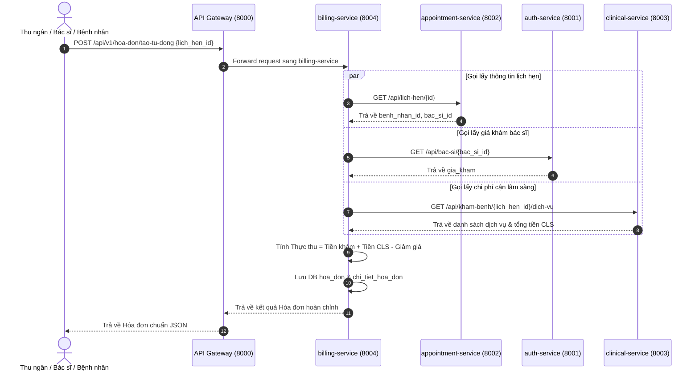

# 📋 BÁO CÁO CÔNG VIỆC PHÂN HỆ 04: HÓA ĐƠN, THANH TOÁN VIỆN PHÍ & LỄ TÂN THU NGÂN (NGƯỜI 4)
> **Dự án:** Hệ Thống Quản Lý Phòng Khám Đa Khoa (Kiến Trúc Microservices)  
> **Người thực hiện:** Người 4 (Toàn) (Phân hệ Hóa Đơn, Quyết Toán & Lễ Tân Thu Ngân)  
> **Thư mục phụ trách:** `billing-service/` (Port `8004`)  
> **Cơ sở dữ liệu:** `db_hoa_don_thanh_toan` (MySQL Port 3306 / 3307)  
> **Tác nhân người dùng chính (Actors):** **Nhân viên Lễ tân kiêm Thu ngân (`LE_TAN`)**, **Bệnh nhân**, và Quản trị viên (`ADMIN`).

---

## 📌 I. TỔNG QUAN VAI TRÒ & NHIỆM VỤ ĐÃ HOÀN THÀNH

Phân hệ 04 là **trung tâm quyết toán tài chính, viện phí và vận hành quầy thu ngân / lễ tân tiếp đón**, chịu trách nhiệm tự động tổng hợp toàn bộ chi phí khám chữa bệnh từ các phân hệ khác, lập hóa đơn, xử lý thanh toán đa kênh, in biên lai, hoàn tiền và cung cấp báo cáo thống kê dòng tiền phòng khám.

### Các thành tựu chính:
1. **Độc lập dịch vụ:** Microservice 04 hoạt động hoàn toàn độc lập trên Port 8004, sở hữu database riêng `db_hoa_don_thanh_toan`.
2. **Cơ chế Tổng hợp Viện phí Tự động Liên dịch vụ (Core Feature):**
   - Gọi đồng thời 3 microservices để tổng hợp chi phí:
     - Gọi `appointment-service:8002`: Lấy `lich_hen_id`, `benh_nhan_id`, `bac_si_id`.
     - Gọi `auth-service:8001`: Lấy giá khám gốc (`gia_kham`) của bác sĩ.
     - Gọi `clinical-service:8003`: Lấy danh sách các dịch vụ cận lâm sàng đã chỉ định và đơn giá từng loại.
   - Tự động tính toán: $\text{Thực thu} = \text{Tiền khám} + \text{Tiền cận lâm sàng} - \text{Giảm giá}$.
3. **Phân hệ Vận Hành Lễ Tân kiêm Thu Ngân (`LE_TAN`) Tại Quầy:**
   - **Tài khoản chuyên trách:** Cung cấp tài khoản mặc định `letan` / `123456` với nút bấm đăng nhập nhanh 1-click.
   - **Trang Thanh toán & Thu ngân (`tab-admin-thu-ngan`):** Xem toàn bộ danh bạ viện phí, tra cứu theo trạng thái (*Chờ thu*, *Đã thu*, *Đã hoàn tiền*).
   - **Thao tác thanh toán trực tiếp:** Hỗ trợ thu tiền mặt, quét mã VietQR tự động theo số tiền, giả lập VNPAY và MoMo.
   - **In biên lai viện phí chuẩn y tế:** In phiếu thu viện phí chi tiết (tiền khám, từng khoản cận lâm sàng, tổng tiền bằng số và bằng chữ).
   - **Nghiệp vụ hoàn tiền viện phí:** Lễ tân có thẩm quyền thực hiện hoàn tiền (`DA_HOAN_TIEN`) kèm lý do đối soát khi bệnh nhân dời/hủy lịch khám.
   - **Liên kết Quản lý Bệnh nhân & Tiếp đón:** Lễ tân có quyền truy cập tab Quản lý Bệnh nhân (`tab-admin-benh-nhan`), xem danh sách lịch hẹn (`tab-benh-nhan-lich`), và thực hiện **Xác nhận tiếp đón** (`DA_XAC_NHAN`) khi bệnh nhân đến làm thủ tục tại quầy.
4. **Cơ chế chịu lỗi (Fault Tolerance & Graceful Degradation):** Thiết lập Timeout và giá trị Fallback an toàn nếu một trong các service liên quan phản hồi chậm hoặc tạm gián đoạn.
5. **Chống thanh toán trùng & Bảo toàn giao dịch:** Chặn tuyệt đối việc thanh toán lại hóa đơn đã thanh toán hoặc đã hoàn tiền (`HTTP 409 Conflict`).
6. **Báo cáo Thống kê Doanh thu:** Cung cấp số liệu tổng thu, số hóa đơn đã thanh toán / chưa thanh toán, phục vụ quản trị phòng khám.

---

## 🗄️ II. CƠ SỞ DỮ LIỆU & MIGRATIONS (`db_hoa_don_thanh_toan`)

### 1. Bảng Hóa Đơn (`hoa_don`)
- **Đường dẫn:** `billing-service/database/migrations/2026_01_01_000001_create_hoa_don_table.php`
- **Các trường:**
  - `id`: Khóa chính tự tăng.
  - `ma_hoa_don`: Mã định danh hóa đơn chuẩn (Unique, Indexed).
  - `lich_hen_id`: Mã lịch hẹn tham chiếu từ Service 02 (Indexed).
  - `benh_nhan_id`: Mã bệnh nhân tham chiếu từ Service 02 (Indexed).
  - `tien_kham`: Tiền khám ban đầu của bác sĩ.
  - `tien_dich_vu`: Tổng tiền các xét nghiệm, siêu âm, cận lâm sàng.
  - `tong_tien`: Tổng chi phí chưa trừ ưu đãi (`tien_kham + tien_dich_vu`).
  - `giam_gia`: Số tiền miễn giảm / bảo hiểm / ưu đãi.
  - `thuc_thu`: Số tiền thực tế bệnh nhân cần thanh toán.
  - `phuong_thuc_thanh_toan`: Enum (`CHUA_XAC_DINH`, `TIEN_MAT`, `CHUYEN_KHOAN`, `VNPAY`, `MOMO`).
  - `trang_thai`: Enum (`CHUA_THANH_TOAN`, `DA_THANH_TOAN`, `DA_HOAN_TIEN`).
  - `ngay_thanh_toan`: Thời điểm ghi nhận giao dịch thành công.
  - `ghi_chu`: Ghi chú thanh toán / xuất hóa đơn đỏ.
  - `timestamps`: `created_at`, `updated_at`.

### 2. Bảng Chi Tiết Hóa Đơn (`chi_tiet_hoa_don`)
- **Đường dẫn:** `billing-service/database/migrations/2026_01_01_000002_create_chi_tiet_hoa_don_table.php`
- **Các trường:**
  - `id`: Khóa chính tự tăng.
  - `hoa_don_id`: Khóa ngoại liên kết `hoa_don.id` (onDelete Cascade).
  - `loai_khoan_thu`: Loại mục thu (`TIEN_KHAM`, `CAN_LAM_SANG`, `THUOC`).
  - `ten_khoan_thu`: Tên dịch vụ hoặc khoản phí chi tiết.
  - `so_luong`: Số lượng chỉ định.
  - `don_gia`: Đơn giá tại thời điểm thực hiện.
  - `thanh_tien`: Thành tiền (`so_luong * don_gia`).

---

## 🌐 III. DANH SÁCH RESTFUL APIS CỦA SERVICE 04 (GATEWAY PORT 8000)

| Phương thức | Đường dẫn API | Phân quyền Gateway | Mô tả nghiệp vụ |
|---|---|---|---|
| `GET` | `/api/v1/hoa-don` | `ADMIN`, `LE_TAN`, `BENH_NHAN` | Lấy danh sách hóa đơn viện phí (Lễ tân & Admin xem toàn viện, Bệnh nhân xem hóa đơn cá nhân/gia đình) |
| `GET` | `/api/v1/hoa-don/{id}` | `ADMIN`, `LE_TAN`, `BENH_NHAN` | Lấy chi tiết hóa đơn và từng dòng mục thu chi tiết |
| `POST` | `/api/v1/hoa-don/tao-tu-dong` | `ADMIN`, `BAC_SI`, `LE_TAN` | **Tự động tổng hợp hóa đơn liên dịch vụ** theo `lich_hen_id` |
| `PUT` | `/api/v1/hoa-don/{id}/thanh-toan` | `ADMIN`, `LE_TAN`, `BENH_NHAN` | Thực hiện thanh toán viện phí (`TIEN_MAT`, `CHUYEN_KHOAN`, `VNPAY`, `MOMO`) |
| `PUT` | `/api/v1/hoa-don/{id}/hoan-tien` | `ADMIN`, `LE_TAN` | **Hoàn tiền viện phí** cho ca khám bị hủy / dời lịch (Ghi nhận lý do và cập nhật trạng thái `DA_HOAN_TIEN`) |
| `GET` | `/api/v1/hoa-don/thong-ke` | `ADMIN`, `LE_TAN` | Báo cáo thống kê tổng doanh thu, thực thu, tỷ lệ thanh toán và ca chờ thu |

---

## 🎨 IV. GIAO DIỆN & TRẢI NGHIỆM NGƯỜI DÙNG (DASHBOARD)

1. **Cổng Quyết Toán Viện Phí Bệnh Nhân (`tab-benh-nhan-vien-phi`):**
   - Bệnh nhân tra cứu toàn bộ viện phí cá nhân và người thân trong gia đình.
   - Thống kê trực quan: Số tiền chờ thanh toán, số tiền đã thanh toán, tổng số hóa đơn.
   - Nút **"Thanh Toán Ngay"** 1-click cho các ca khám chưa quyết toán.
2. **Quầy Thu Ngân & Lễ Tân Tiếp Đón (`tab-admin-thu-ngan` & `tab-admin-benh-nhan`):**
   - Nhân viên Lễ tân đăng nhập trực tiếp bằng tài khoản `letan` / `123456`.
   - Xem toàn bộ danh bạ hóa đơn viện phí, bộ lọc nhanh theo 4 trạng thái (*Tất cả*, *Chờ thu*, *Đã thu*, *Đã hoàn tiền*).
   - Nút **"Thanh toán"** mở modal quyết toán viện phí trực tiếp tại quầy.
   - Nút **"Hoàn tiền"** cho phép nhân viên lễ tân/thu ngân hoàn tiền ngay khi bệnh nhân hủy ca khám.
   - Tab **Quản lý Bệnh nhân** và **Tiếp đón lịch hẹn** cho phép Lễ tân kiểm tra danh tính và bấm **Xác nhận tiếp đón** bệnh nhân khi đến phòng khám.
3. **Thanh Toán Đa Kênh Tích Hợp VietQR:**
   - Hỗ trợ thanh toán nhanh qua quét mã VietQR tự động sinh theo số tiền và mã hóa đơn chuẩn.
   - Giả lập cổng thanh toán trực tuyến VNPAY và MoMo.
4. **In Biên Lai Viện Phí Chuẩn Y Tế:**
   - Hỗ trợ in mẫu biên lai thu tiền chi tiết từng hạng mục (công khám, xét nghiệm, siêu âm, giảm giá, thực thu và chữ ký kế toán/thu ngân).

---

## 🔗 V. TÍCH HỢP LIÊN DỊCH VỤ (INTER-SERVICE INTEGRATION)

```mermaid
sequenceDiagram
    autonumber
    actor Admin as Thu ngân / Bác sĩ / Bệnh nhân
    participant GW as API Gateway (8000)
    participant Bill as billing-service (8004)
    participant Appt as appointment-service (8002)
    participant Auth as auth-service (8001)
    participant Clin as clinical-service (8003)

    Admin->>GW: POST /api/v1/hoa-don/tao-tu-dong {lich_hen_id}
    GW->>Bill: Forward request sang billing-service
    par Gọi lấy thông tin lịch hẹn
        Bill->>Appt: GET /api/lich-hen/{id}
        Appt-->>Bill: Trả về benh_nhan_id, bac_si_id
    and Gọi lấy giá khám bác sĩ
        Bill->>Auth: GET /api/bac-si/{bac_si_id}
        Auth-->>Bill: Trả về gia_kham
    and Gọi lấy chi phí cận lâm sàng
        Bill->>Clin: GET /api/kham-benh/{lich_hen_id}/dich-vu
        Clin-->>Bill: Trả về danh sách dịch vụ & tổng tiền CLS
    end
    Bill->>Bill: Tính Thực thu = Tiền khám + Tiền CLS - Giảm giá
    Bill->>Bill: Lưu DB hoa_don & chi_tiet_hoa_don
    Bill-->>GW: Trả về kết quả Hóa đơn hoàn chỉnh
    GW-->>Admin: Trả về Hóa đơn chuẩn JSON
```

---

## 🎯 VI. KIỂM THỬ TÍCH HỢP & FEATURE TESTS
1. **Kiểm thử tự động hóa `HoaDonTest.php`:**
   - `test_tao_hoa_don_thanh_cong_khi_ca_3_service_hoat_dong_tot`: **PASSED**
   - `test_tao_hoa_don_khi_clinical_service_loi_500`: **PASSED (Cơ chế chịu lỗi)**
   - `test_thanh_toan_hai_lan_tra_ve_409_conflict`: **PASSED (Chống thanh toán trùng)**
   - `test_hoan_tien_va_chan_thanh_toan_khi_da_hoan_tien`: **PASSED (Chống xung đột hoàn tiền)**
2. **Kiểm thử tích hợp toàn diện qua `kiem-tra-he-thong.php`:**
   - Đạt **100%** toàn bộ 11 tiêu chí kỹ thuật và nghiệp vụ liên dịch vụ.
